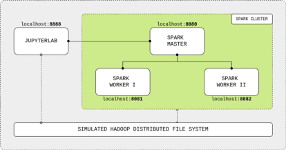
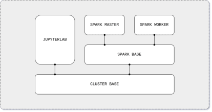

# Big Data

## Overview

## 1. Create Cluster Base Image Dockerfile

[cluster base image](./cluster-base.Dockerfile)

## 2. Create Spark Base Image Dockerfile

[spark base image](./spark-base.Dockerfile)

## 3. Create Spark Master Image Dockerfile

[spark master image](./spark-master.Dockerfile)

## 4. Create Spark Worker Image Dockerfile

[spark worker image](./spark-worker.Dockerfile)

## 5. Create Jupyter Lab Image Dockerfile

[jupyterlab image](./jupyterlab.Dockerfile)

## 6. build all images

[build.sh](./build.sh)

## 7. create docker-compose file

[docker-compose.yml](./docker-compose.yml)

## 8. write first pyspark application in jupyterlab

[./app.py](./app.py)

## more..

[user guide](https://spark.apache.org/docs/latest/api/python/user_guide/index.html)
